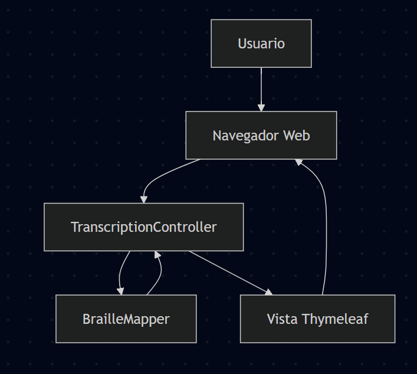

# Diseño arquitectónico de alto nivel

## Resumen
Este documento describe la arquitectura general de la aplicación "Spanish Braille Application".

## Componentes principales
- `controller` : clases que manejan las peticiones HTTP y coordinan la lógica.
- `service` : clases que contienen la lógica de negocio, por ejemplo `BrailleMapper`.
- `templates` : plantillas Thymeleaf (`index.html`, `result.html`) para la interfaz web.
- `static` : recursos estáticos (CSS, imágenes).

## Responsabilidades
- Controller: recibir entrada del usuario, invocar el servicio y devolver la vista.
- Service: procesar la transcripción a Braille y devolver datos listos para la vista.

## Flujo de datos (ejemplo)
1. Usuario envía texto desde la página principal.
2. `TranscriptionController` recibe la petición y llama a `BrailleMapper`.
3. `BrailleMapper` transforma el texto en la representación Braille.
4. El resultado se envía a la plantilla `result.html` para mostrar al usuario.

## Diagrama

Figura: Diagrama arquitectónico de la aplicación (archivo: documentacion/images/DiagramaArquitectonico.png)

## Tecnologías usadas
- Java 21
- Spring Boot 3.x
- Thymeleaf
- Maven

---

