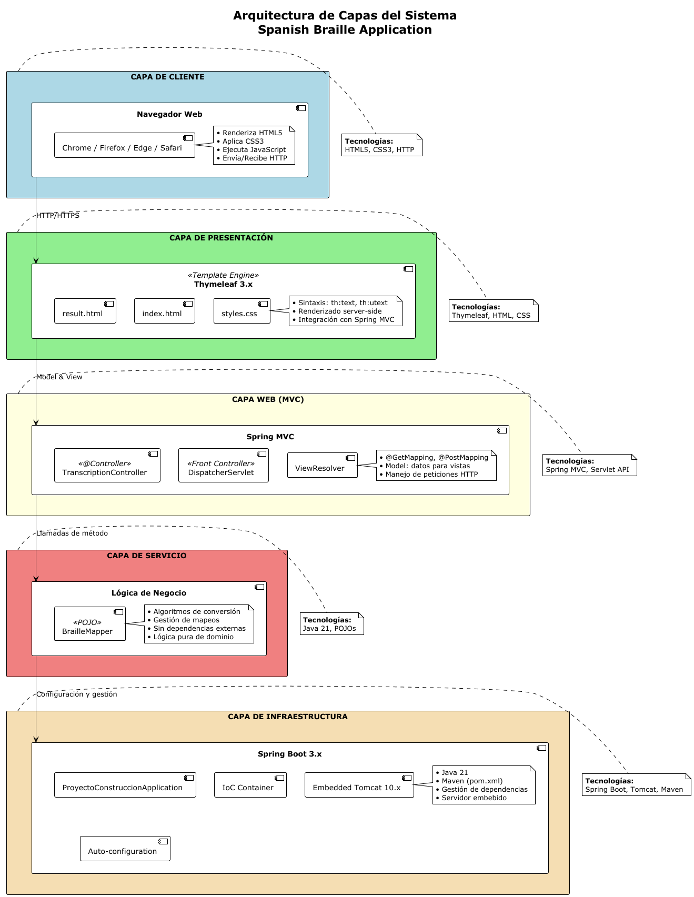

# Diseño Arquitectónico de Alto Nivel

## 1. Resumen Ejecutivo
Este documento describe la arquitectura de la aplicación "Spanish Braille Application", un sistema web para la transcripción de texto en español a su representación en Braille Unicode. La aplicación sigue el patrón arquitectónico **MVC (Modelo-Vista-Controlador)** implementado sobre el framework **Spring Boot**.

## 2. Objetivos Arquitectónicos
- **Simplicidad**: Arquitectura clara y fácil de mantener
- **Separación de responsabilidades**: Cada capa tiene funciones bien definidas
- **Extensibilidad**: Facilitar la incorporación de nuevas funcionalidades
- **Rendimiento**: Procesamiento eficiente de transcripciones
- **Mantenibilidad**: Código documentado y estructura modular

## 3. Patrón Arquitectónico: MVC

### 3.1 Vista (View Layer)
**Responsabilidad**: Presentación e interacción con el usuario

**Componentes**:
- **`index.html`**: Página principal con formulario de entrada
  - Permite al usuario ingresar texto en español
  - Incluye instrucciones de uso
  - Maneja la validación básica del formulario
  
- **`result.html`**: Página de resultados
  - Muestra el texto original y la transcripción en Braille
  - Proporciona opciones para nueva transcripción e impresión
  
- **`styles.css`**: Hoja de estilos
  - Define la apariencia visual de la aplicación
  - Estilos específicos para caracteres Braille

**Tecnología**: Thymeleaf Template Engine

### 3.2 Controlador (Controller Layer)
**Responsabilidad**: Gestión de peticiones HTTP y coordinación del flujo de datos

**Componente principal**:
- **`TranscriptionController`**
  - **Endpoint GET "/"**: Renderiza la página principal
  - **Endpoint POST "/transcribir"**: Procesa solicitudes de transcripción
    - Recibe el texto del usuario
    - Invoca el servicio de transcripción
    - Prepara el modelo de datos para la vista
    - Retorna la vista de resultados

**Tecnología**: Spring MVC (@Controller, @GetMapping, @PostMapping)

### 3.3 Modelo/Servicio (Service Layer)
**Responsabilidad**: Lógica de negocio y procesamiento de datos

**Componente principal**:
- **`BrailleMapper`**
  - Implementa el algoritmo de conversión Español → Braille Unicode
  - Gestiona tres series oficiales del Braille español (a-j, k-t, u-z)
  - Maneja casos especiales:
    - Letras acentuadas (á, é, í, ó, ú)
    - Caracteres especiales (ñ, ü)
    - Mayúsculas (con signo especial ⠠)
    - Números (con signo de número ⠼)
    - Puntuación (coma, punto, interrogación, etc.)
  - Normaliza espacios múltiples
  - Convierte máscaras binarias a caracteres Unicode (rango U+2800+)

**Estructura interna**:
- `Map<String, Integer>`: Tabla de mapeo carácter → máscara Braille
- Métodos de inicialización: `initLetters()`, `initAccents()`, `initPunctuation()`, `initNumbers()`
- Método principal: `transcribir(String texto)`

### 3.4 Capa de Aplicación
**Componente**:
- **`ProyectoConstruccionApplication`**
  - Punto de entrada de la aplicación (@SpringBootApplication)
  - Inicializa el contenedor Spring IoC
  - Configura el servidor embebido (Tomcat por defecto)

## 4. Flujo de Datos Detallado

### 4.1 Flujo de Transcripción
```
1. [Usuario] → Accede a la URL raíz "/"
   ↓
2. [Spring DispatcherServlet] → Enruta la petición
   ↓
3. [TranscriptionController.index()] → Retorna vista "index"
   ↓
4. [Thymeleaf] → Renderiza index.html
   ↓
5. [Usuario] → Ingresa texto y envía formulario (POST /transcribir)
   ↓
6. [Spring DispatcherServlet] → Enruta la petición POST
   ↓
7. [TranscriptionController.transcribir()] → Recibe parámetro "texto"
   ↓
8. [BrailleMapper.transcribir()] → Procesa el texto
   - Normaliza espacios
   - Identifica mayúsculas → añade signo ⠠
   - Identifica números → añade signo ⠼
   - Convierte cada carácter usando el mapa
   - Genera string Unicode Braille
   ↓
9. [TranscriptionController] → Añade atributos al Model
   - textoOriginal
   - resultadoBraille
   ↓
10. [Thymeleaf] → Renderiza result.html con los datos
    ↓
11. [Usuario] → Visualiza el resultado en Braille Unicode
```

## 5. Estructura de Capas

```
┌─────────────────────────────────────────────────────────────┐
│                   CAPA DE PRESENTACIÓN                      │
│  (Templates Thymeleaf + CSS + Navegador del Usuario)       │
│                                                             │
│  • index.html  • result.html  • styles.css                  │
└─────────────────────┬───────────────────────────────────────┘
                      │ HTTP Request/Response
┌─────────────────────▼───────────────────────────────────────┐
│                    CAPA DE CONTROL                          │
│         (Spring MVC Controllers + DispatcherServlet)        │
│                                                             │
│  • TranscriptionController                                  │
│    - GET /                                                  │
│    - POST /transcribir                                      │
└─────────────────────┬───────────────────────────────────────┘
                      │ Método Java
┌─────────────────────▼───────────────────────────────────────┐
│                   CAPA DE SERVICIO                          │
│              (Lógica de Negocio / Dominio)                  │
│                                                             │
│  • BrailleMapper                                            │
│    - transcribir(String texto): String                      │
│    - Mapas de conversión (letras, números, acentos, etc.)  │
└─────────────────────────────────────────────────────────────┘
                      │
┌─────────────────────▼───────────────────────────────────────┐
│                 INFRAESTRUCTURA SPRING                      │
│  • Spring Boot Framework                                    │
│  • Servidor Embebido (Tomcat)                               │
│  • Thymeleaf View Resolver                                  │
│  • IoC Container                                            │
└─────────────────────────────────────────────────────────────┘
```

## 6. Diagramas



## 7. Decisiones Arquitectónicas Clave

### 7.1 Uso de Spring Boot
**Justificación**: 
- Configuración automática reduce complejidad
- Servidor embebido facilita despliegue
- Gran ecosistema y comunidad activa
- Inyección de dependencias para testing

### 7.2 Thymeleaf como Motor de Templates
**Justificación**:
- Integración nativa con Spring
- Sintaxis natural HTML5
- Renderizado del lado del servidor (SEO friendly)
- Fácil testeo

### 7.3 BrailleMapper sin Base de Datos
**Justificación**:
- Mapeo estático suficiente para alfabeto Braille
- Mejor rendimiento (datos en memoria)
- Sin necesidad de persistencia
- Menor complejidad operacional

### 7.4 Arquitectura sin Estado (Stateless)
**Justificación**:
- Cada petición es independiente
- Facilita escalamiento horizontal
- Mayor simplicidad

## 8. Consideraciones de Calidad

### 8.1 Rendimiento
- Procesamiento en memoria (O(n) lineal con longitud de texto)
- Sin operaciones de I/O durante transcripción
- Respuesta inmediata para textos típicos (<1 segundo)

### 8.2 Escalabilidad
- Arquitectura stateless permite múltiples instancias
- Sin cuellos de botella en base de datos
- Fácil contenerización (Docker)

### 8.3 Mantenibilidad
- Código documentado con JavaDoc
- Separación clara de responsabilidades
- Pruebas unitarias (BrailleMapperTest)
- Bajo acoplamiento entre componentes

### 8.4 Seguridad
- Validación de entrada en formularios
- Sin almacenamiento de datos sensibles
- Thymeleaf previene XSS automáticamente

## 9. Tecnologías y Herramientas

| Capa | Tecnología | Versión | Propósito |
|------|-----------|---------|-----------|
| Backend | Java | 21 | Lenguaje principal |
| Framework | Spring Boot | 3.x | Framework web |
| View Engine | Thymeleaf | 3.x | Renderizado de vistas |
| Build Tool | Maven | 3.x | Gestión de dependencias |
| Testing | JUnit | 5.x | Pruebas unitarias |
| Frontend | HTML5/CSS3 | - | Interfaz de usuario |

## 10. Extensibilidad Futura

La arquitectura permite fácilmente:
- **Añadir nuevos endpoints** (e.g., API REST para transcripción)
- **Implementar transcripción inversa** (Braille → Español)
- **Agregar más idiomas** (crear nuevos Mappers)
- **Persistencia de historial** (añadir capa de repositorio)
- **Exportación a PDF/Word** (nuevos servicios)
- **API pública** (añadir @RestController)

## 11. Documentación Complementaria

Este documento forma parte de un conjunto de documentación técnica:

- **`diagramas-complementarios.md`**: Diagramas de secuencia detallados, diagramas de componentes, flujos de datos internos y patrones de diseño
- **`casos-prueba.md`**: Casos de prueba y validación
- **`manual-usuario.md`**: Guía de uso para usuarios finales
- **`javadoc-resumen.md`**: Documentación de código fuente

## 12. Referencias
- Documentación Spring Boot: https://spring.io/projects/spring-boot
- Especificación Braille Español: Sistema oficial de 3 series
- Unicode Braille Patterns: U+2800 a U+28FF

---

**Documento elaborado por**: Grupo 7  
**Última actualización**: 24/11/2025  
**Versión**: 2.0

